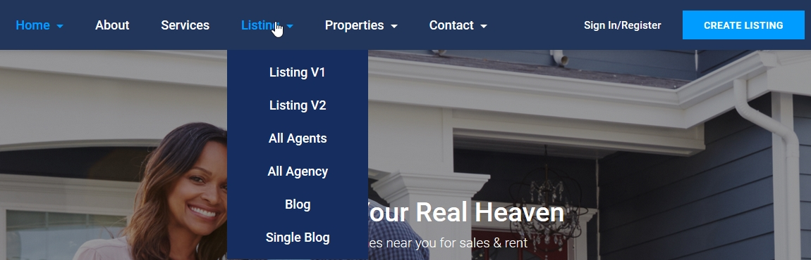
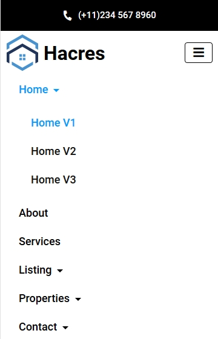

# Site Navigation





### Site Navigation HTML Code

The below code can be found in all HTML pages that are included with the theme. code will be placed from 149th to 188th line of each page.

```markup
<ul class="nav navbar-nav underline">
    <li class="nav-item dropdown nav-item active ">
        <a data-toggle="dropdown" class="dropdown-toggle" href="#" title="Home" id="home">Home <span class="caret"></span></a>
        <ul class="dropdown-menu">
            <li class="nav-item active "><a href="index.html" title="Home V1" id="home-v1">Home V1</a></li>
            <li class="nav-item"><a href="home-v2.html" title="Home V2" id="home-v2">Home V2</a></li>
            <li class="nav-item"><a href="home-v3.html" title="Home V3" id="home-v3">Home V3</a></li>
        </ul>
    </li>
    <li class="nav-item"><a href="about-us.html" title="About" id="about-page">About</a></li>
    <li class="nav-item"><a href="services.html" title="Services" id="services">Services</a></li>
    <li class="nav-item dropdown "><a data-toggle="dropdown" class="dropdown-toggle" href="#" title="Listing" id="listing-page">Listing
        <span class="caret"></span></a>
        <ul class="dropdown-menu">
            <li class="nav-item"><a href="listing-v1.html" title="Listing V1" id="listing-v1">Listing V1</a></li>
            <li class="nav-item"><a href="listing-v2.html" title="Listing V2" id="listing-v2">Listing V2</a></li>
            <li class="nav-item"><a href="all-agents.html" title="All Agents" id="all-agents">All Agents</a></li>
            <li class="nav-item"><a href="all-agency.html" title="All Agency" id="all-agency">All Agency</a></li>
            <li class="nav-item"><a href="blog.html" title="Blog" id="blog">Blog</a></li>
            <li class="nav-item"><a href="blog-single.html" title="Single Blog" id="blog-single">Single Blog</a></li>
        </ul>
    </li>
    <li class="nav-item dropdown ">
        <a data-toggle="dropdown" class="dropdown-toggle" href="#" title="Properties" id="property-page">Properties <span class="caret"></span></a>
        <ul class="dropdown-menu">
            <li class="nav-item"><a href="property-details-v1.html" title="Property Details V1" id="property-details-v1">Property Details V1</a></li>
            <li class="nav-item"><a href="property-details-v2.html" title="Property Details V2" id="property-details-v2">Property Details V2</a></li>
            <li class="nav-item"><a href="agent-details.html" title="Agent Details" id="agent-details">Agent Details</a></li>
            <li class="nav-item"><a href="agency-details.html" title="Agency Details" id="agency-details">Agency Details</a></li>
        </ul>
    </li>
    <li class="nav-item dropdown "><a data-toggle="dropdown" class="dropdown-toggle" href="#" title="Contact" id="contact">Contact
        <span class="caret"></span></a>
        <ul class="dropdown-menu">
            <li class="nav-item"><a href="contact-v1.html" title="Contact V1" id="contact-v1">Contact V1</a></li>
            <li class="nav-item"><a href="contact-v2.html" title="Contact V2" id="contact-v2">Contact V2</a></li>
            <li class="nav-item"><a href="contact-v3.html" title="Contact V3" id="contact-v3">Contact V3</a></li>
        </ul>
    </li>
</ul>
```

